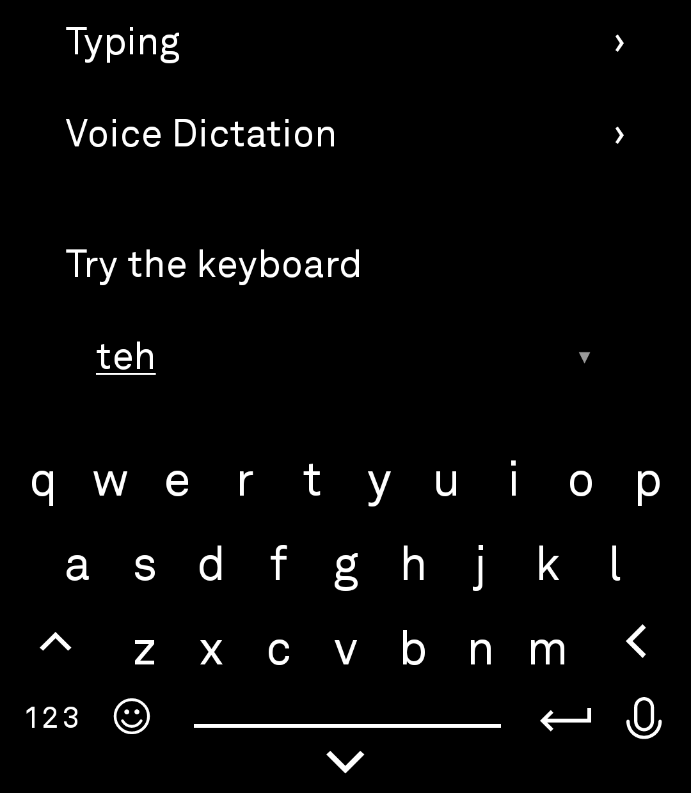
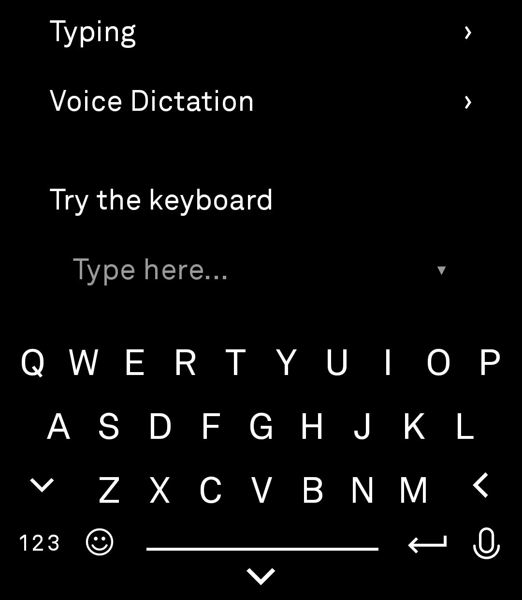
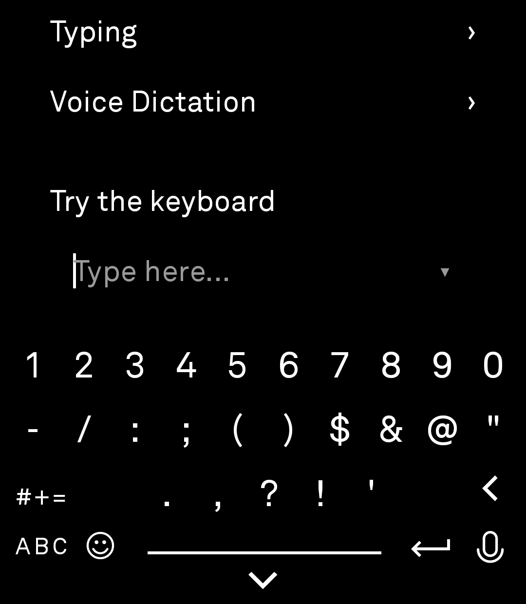
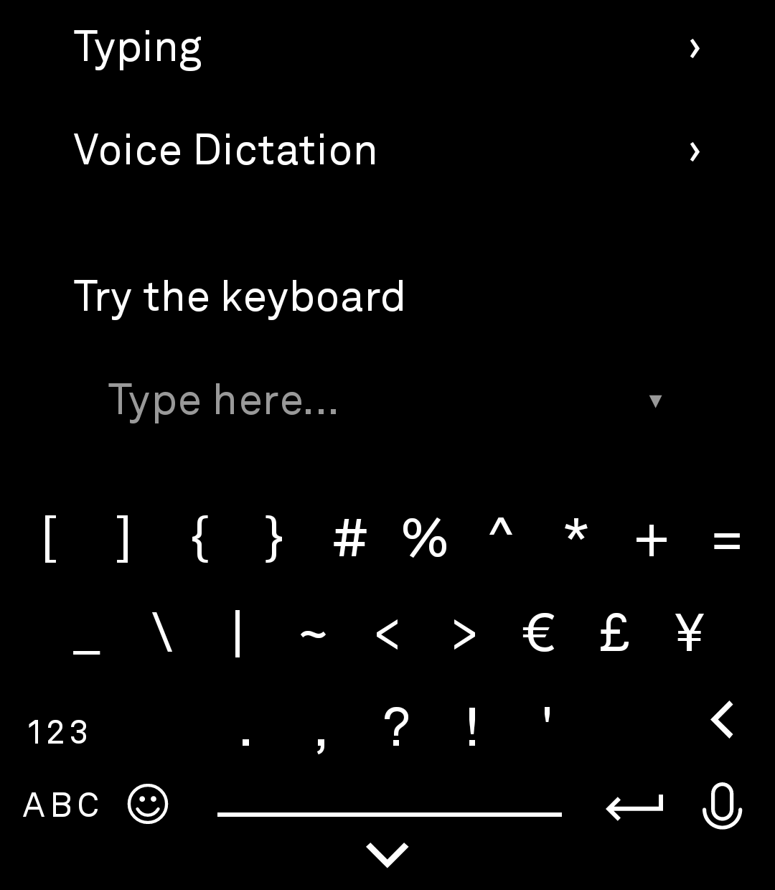
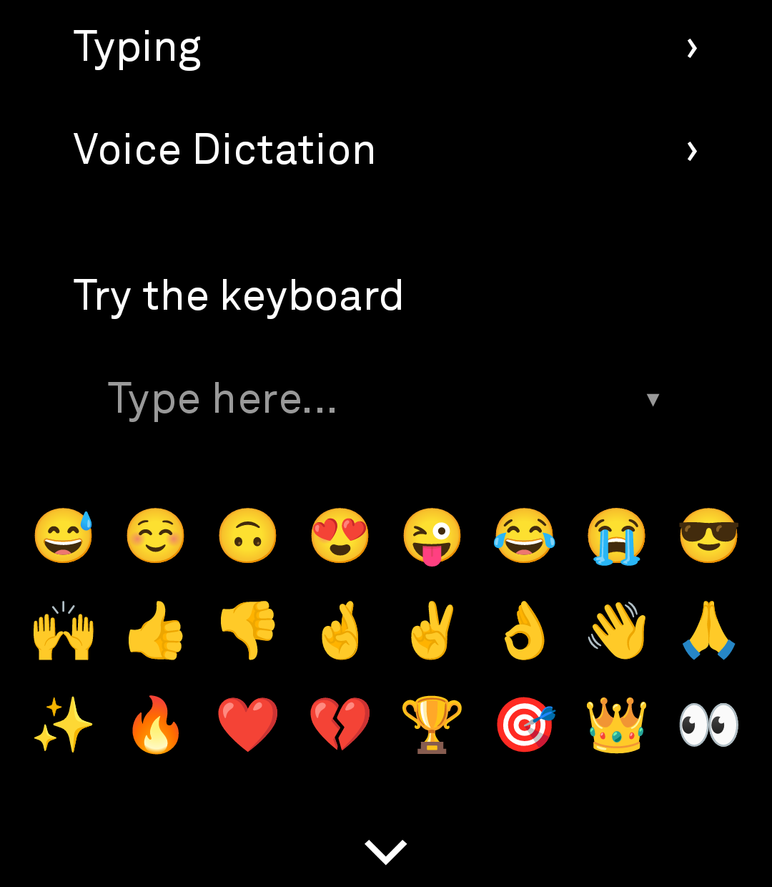
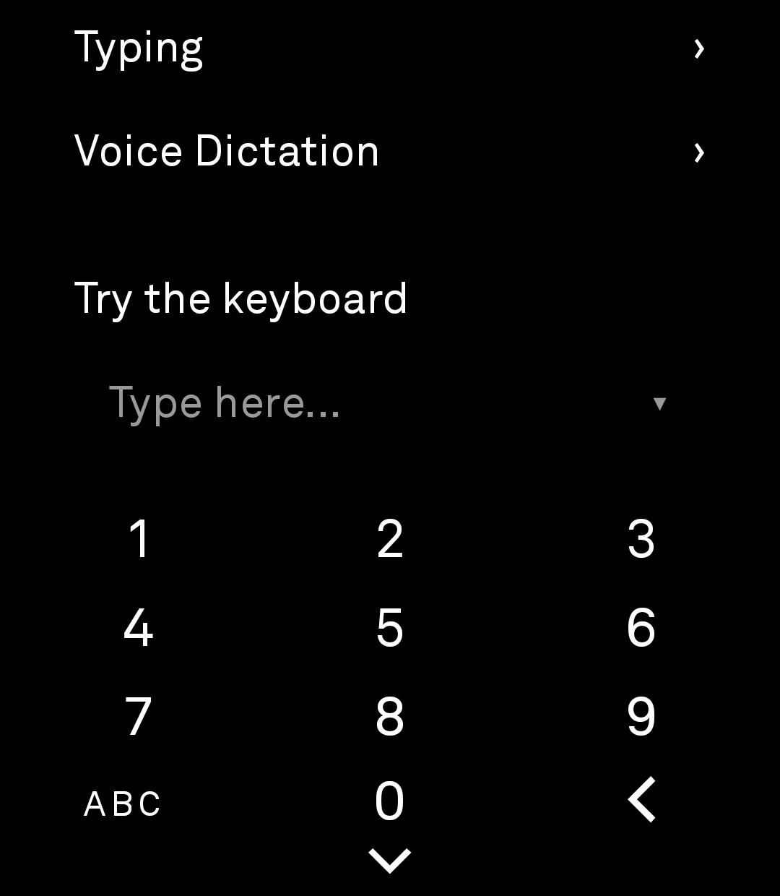
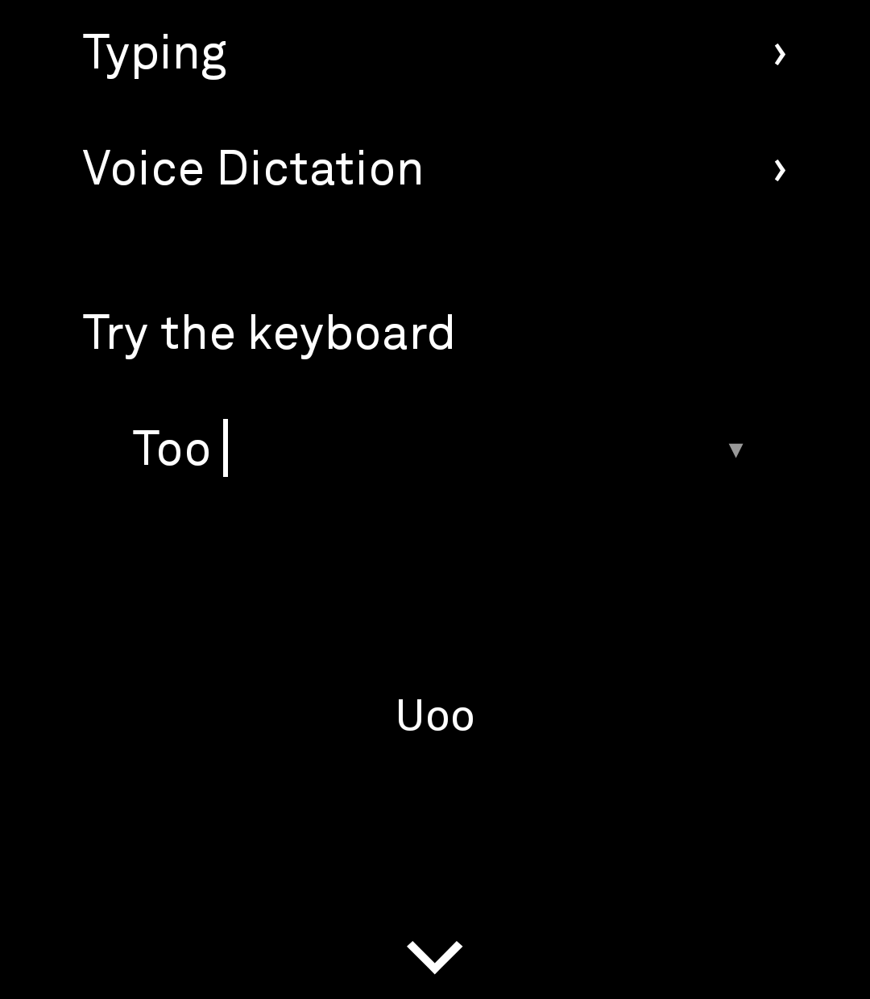
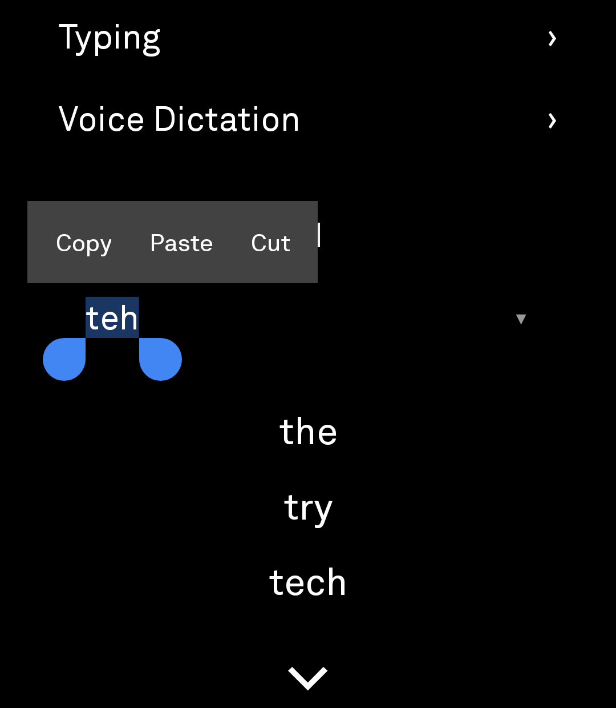

# SuperLight Keyboard — Initial Release

A private, Light Phone 3–style Android system keyboard combining the LPIII Keyboard interface with expanded on-device typing tools. Set it as your default keyboard to use it in any Android app.

## What’s included

- **Offline voice-to-text:** fully integrated with the Vosk engine; speech is processed on-device.
- **Autocorrect:** intelligent word correction, with revert-on-backspace support.
- **Auto-capitalization and auto-period:** modern typing conveniences, enabled by default.
- **Numbers, symbols, and emoji layouts:** reachable from the main keyboard's toggle keys.
- **Dedicated numeric keypad:** shown automatically for number/phone/date fields, or forced with a long-press on the "123" key for fields that don't declare themselves numeric.
- **Copy & paste menu:** a clipboard history overlay, opened with a long-press on the space bar.
- **Redesigned settings:** a custom, minimalist interface aligned with the Light Phone 3 aesthetic.
- **Suggestions UI:** a minimalist overlay for correcting misspelled words.

## Screenshots

<table>
<tr>
<td> Letters</td>
<td> Shift</td>
<td> Numbers</td>
</tr>
<tr>
<td> Symbols</td>
<td> Emoji</td>
<td> Numeric keypad (long-press on lower left numbers)</td>
</tr>
<tr>
<td> Copy &amp; paste menu</td>
<td> Spelling suggestions</td>
</tr>
</table>

## Recent fixes (v1.2.3)

Backspace had a run of regressions while the numeric keypad and clipboard menu were being built, across both the numpad and the standard keyboard, in third-party apps in particular. Root causes and fixes:

- **Backspace doing nothing in some apps:** a prior fix had switched deletion from a real key event to `InputConnection.deleteSurroundingText()`. Some apps (particularly ones with custom or cross-platform text fields) never implement that method, so the delete silently no-opped. Restored a real key-event fallback for the cases that need it.
- **Backspace jumping back several characters, or deleting the wrong spot on the numpad:** typed digits were tracked the same way as letters, through the keyboard's spell-check/autocorrect "composing" region. Numeric fields (phone numbers, dates) commonly reformat text and move the cursor as you type, which drifted that tracked position away from the field's real cursor. Digits are no longer tracked through the composing region at all.
- **A single backspace occasionally deleting several characters in a row:** a self-check that verified a delete had landed (to decide whether to fall back to the key event above) read the field's text back immediately, but some fields apply edits a frame late. Fast repeated presses could read stale text, wrongly conclude the delete failed, and fire a second delete on top of one that actually landed a moment later. Removed the self-check; deletion is now a single, deterministic step.
- **A whole word vanishing instead of one character:** composing regions need to be finished before backspace acts on them, or some apps cancel the entire in-progress word on a single delete. Backspace now shrinks the composing region in place with one call instead of finishing it, deleting, and re-establishing it as three separate steps - the sequence that was triggering that cancellation.

The underline you see under a word while it's still being typed (visible in the screenshots above) is a side effect of that same composing region, and the spelling-suggestions overlay is shown when you select a word that comes back flagged as a typo.

For the full debugging trail behind these fixes - what was tried, why each attempt failed, and a decision guide for the next backspace bug - see [`docs/ime-backspace-debugging.md`](docs/ime-backspace-debugging.md).

## Recent fixes (v1.2.4)

- **Autocorrect's revert-on-backspace wasn't reverting.** Pressing backspace right after autocorrect changed a word was supposed to undo the correction and give you back exactly what you typed - useful when the "fix" wasn't actually what you meant. The check that detects this (comparing the text before the cursor) was missing the trailing space/punctuation autocorrect also commits, so it could never match and the revert silently never fired. Fixed; one backspace right after a correction now restores your original spelling.

## Recent fixes (v1.2.5)

- **The manually-forced numeric keypad (long-press "123") would snap back to letters after typing a single digit**, on any field that doesn't declare itself numeric. Some fields restart their input connection on every keystroke; the keyboard was re-checking "is this field numeric?" on every such restart and reverting because the answer is always "no" for a non-numeric field - discarding the manual override it had just been asked to keep. The check now only runs when a genuinely new field is focused, not on same-field restarts.
- **The keyboard could get stuck on symbols, emoji, or the numpad after switching apps.** Only the numpad had logic to reset back to letters when moving to a new, non-numeric field; the "123" toggle row, symbols, and emoji layouts had no such reset, so whichever one you left open could still be showing the next time you opened a completely unrelated app - not how keyboards are expected to behave elsewhere on Android. Moving to a new field now always resets to the default alphabet layout unless that field is itself numeric.

## Recent fixes (v1.2.6)

- **The leftmost and rightmost key in each row were harder to hit accurately than the keys in between.** Every row centers its keys, but the keys' combined width doesn't quite reach the screen edges, leaving an empty, non-clickable margin on each side that isn't part of any key's touch target - a tap that lands short (very common right at the bezel) missed entirely, where the same kind of miss on an interior key would still land on a neighbor. The first and last key in every row now catch taps all the way out to the screen edge, matching how Gboard and iOS extend their own edge keys - the keys' visible position and size are unchanged, only the touch target grew.

## Recent fixes (v1.2.7)

- **Added a "LightOS-style Key Spacing" setting (Typing settings, off by default).** The v1.2.6 fix that extended the first/last key in each row out to the screen edge changed the keyboard's touch targets slightly from the original Light Phone 3 layout. Most people won't notice, but if you'd rather have the exact original LightOS spacing back, this toggle restores it - each key's hitbox reverts to stopping at its own visible width, with no other behavior changes.

## Install and set up

Download the latest APK from [Releases](../../releases) and open it on your Android device. Then open **Light Keyboard** and:

1. Enable it in Android’s keyboard settings.
2. Choose it as the active keyboard.

Voice dictation may download an offline Vosk speech model the first time it is enabled.

## Credits and attribution

This release combines and builds on two open-source projects:

- **[LPIII Keyboard](https://github.com/lightphone/lp3-keyboard)** by [The Light Phone](https://github.com/lightphone), which provides the Light Phone 3 keyboard implementation and visual foundation.
- **[Light Keyboard](https://github.com/adam-weber/light-keyboard)** by [Adam Weber](https://github.com/adam-weber), which provides the Android system-keyboard packaging and on-device typing features.

All credit for the original projects, their code, and their designs remains with their respective publishers and contributors. This is an independent combined release; it is not affiliated with or endorsed by The Light Phone.

## License

This project retains the applicable licenses and notices from its upstream sources. See the included license files and upstream repositories for their complete terms.
